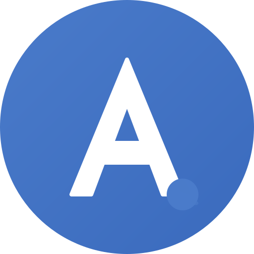

<div align="center">
  
  
  # attest.ink
  
  **Beautiful AI Attribution Badges for the Modern Web**
  
  [](https://opensource.org/licenses/MIT)
  [](https://attest.ink)
  
  <br>
  
  <a href="https://attest.ink">
    
  </a>
  
  [Live Demo](https://attest.ink) • [Documentation](https://attest.ink/docs.html) • [Badge Showcase](https://attest.ink/badge-showcase.html) • [PNG Generator](https://attest.ink/badge-generator.html)
</div>

---

## ✨ Overview

attest.ink provides beautiful, customizable badges for transparent AI attribution. With 10+ styles, 6 size variants, and full dark mode support, you can clearly indicate when content is AI-assisted while maintaining your design aesthetic.

<div align="center">
  <table>
    <tr>
      <td align="center">
        
      </td>
      <td align="center">
        
      </td>
      <td align="center">
        
      </td>
    </tr>
  </table>
</div>

## 🚀 Quick Start

### Option 1: Simple PNG Badge (Easiest)
```html
<!-- No CSS required! -->

```

### Option 2: Interactive HTML Badge
```html
<!-- Include CSS -->
<link rel="stylesheet" href="https://attest.ink/css/badge-variants.css">

<!-- Add Badge -->
<a href="https://attest.ink" class="ai-badge ai-badge-medium ai-badge-glass">
    <svg class="ai-logo" viewBox="0 0 24 24" fill="none" xmlns="http://www.w3.org/2000/svg">
        <circle cx="12" cy="12" r="10" stroke="currentColor" stroke-width="1.5"/>
        <path d="M8 12C8 9.79086 9.79086 8 12 8C14.2091 8 16 9.79086 16 12C16 14.2091 14.2091 16 12 16" stroke="currentColor" stroke-width="1.5" stroke-linecap="round"/>
        <circle cx="12" cy="12" r="2" fill="currentColor"/>
        <path d="M12 6V8M12 16V18M18 12H16M8 12H6" stroke="currentColor" stroke-width="1.5" stroke-linecap="round"/>
    </svg>
    <span>Made with AI</span>
</a>
```

### Option 3: Markdown
```markdown
[](https://attest.ink)
```

## 🎨 Features

### Badge Styles
<table>
  <tr>
    <td><b>Glass</b></td>
    <td>Elegant transparency with blur effects</td>
  </tr>
  <tr>
    <td><b>Solid</b></td>
    <td>Bold and prominent design</td>
  </tr>
  <tr>
    <td><b>Outline</b></td>
    <td>Clean border-based style</td>
  </tr>
  <tr>
    <td><b>Gradient</b></td>
    <td>Modern color transitions</td>
  </tr>
  <tr>
    <td><b>Neon</b></td>
    <td>Eye-catching glow effects</td>
  </tr>
  <tr>
    <td><b>Neumorphic</b></td>
    <td>Soft 3D appearance</td>
  </tr>
  <tr>
    <td><b>Glow</b></td>
    <td>Subtle luminescence</td>
  </tr>
  <tr>
    <td><b>Ghost</b></td>
    <td>Minimal transparency</td>
  </tr>
  <tr>
    <td><b>Minimal</b></td>
    <td>Ultra-clean design</td>
  </tr>
  <tr>
    <td><b>Mono</b></td>
    <td>Monochromatic elegance</td>
  </tr>
</table>

### Size Variants
- `micro` - 20px height
- `mini` - 24px height
- `small` - 28px height
- `medium` - 32px height (default)
- `large` - 40px height
- `xl` - 48px height

### Platform-Specific Badges
- Generic AI
- Claude
- ChatGPT
- Gemini
- Midjourney
- DALL-E
- GitHub Copilot
- Perplexity
- Logo Only (icon without text)

## 🛠️ Usage

### Basic Badge
```html
<a href="https://attest.ink" class="ai-badge ai-badge-medium ai-badge-glass">
    <!-- SVG icon -->
    <span>Made with AI</span>
</a>
```

### Customization Examples

#### Different Styles
```html
<!-- Gradient style -->
<a href="https://attest.ink" class="ai-badge ai-badge-medium ai-badge-gradient">
    <!-- SVG icon -->
    <span>Made with AI</span>
</a>

<!-- Neon style -->
<a href="https://attest.ink" class="ai-badge ai-badge-medium ai-badge-neon">
    <!-- SVG icon -->
    <span>Made with AI</span>
</a>
```

#### Different Sizes
```html
<!-- Large badge -->
<a href="https://attest.ink" class="ai-badge ai-badge-large ai-badge-solid">
    <!-- SVG icon -->
    <span>Made with AI</span>
</a>

<!-- Micro badge -->
<a href="https://attest.ink" class="ai-badge ai-badge-micro ai-badge-minimal">
    <!-- SVG icon -->
    <span>AI</span>
</a>
```

#### Platform Specific
```html
<!-- Claude badge -->
<a href="https://attest.ink" class="ai-badge ai-badge-medium ai-badge-glass ai-badge-claude">
    <!-- SVG icon -->
    <span>Claude AI</span>
</a>

<!-- ChatGPT badge -->
<a href="https://attest.ink" class="ai-badge ai-badge-medium ai-badge-gradient ai-badge-chatgpt">
    <!-- SVG icon -->
    <span>ChatGPT</span>
</a>
```

### Positioning
```css
/* Bottom right (default) */
.badge-position-bottom-right { 
    position: absolute; 
    bottom: 1rem; 
    right: 1rem; 
}

/* Other positions */
.badge-position-bottom-left { 
    position: absolute; 
    bottom: 1rem; 
    left: 1rem; 
}

.badge-position-top-right { 
    position: absolute; 
    top: 1rem; 
    right: 1rem; 
}

.badge-position-top-left { 
    position: absolute; 
    top: 1rem; 
    left: 1rem; 
}
```

## 🌙 Dark Mode

Badges automatically adapt to your site's theme:

```css
/* Automatic dark mode support */
[data-theme="dark"] {
    /* Badges will automatically adjust their colors */
}

/* Or use prefers-color-scheme */
@media (prefers-color-scheme: dark) {
    /* Badges adapt automatically */
}
```

## 📦 Installation Options

### PNG Badges (No Installation Required!)
Simply use the image URL directly:
```html

```
[Browse all PNG badges →](https://attest.ink/badge-generator.html)

### CDN (For Interactive Badges)
```html
<!-- Modern badges -->
<link rel="stylesheet" href="https://attest.ink/css/badge-variants.css">

<!-- Backward compatibility (optional) -->
<link rel="stylesheet" href="https://attest.ink/css/badge-compatibility.css">
```

### Self-Hosted
1. Download the CSS files from our [GitHub repository](https://github.com/statusdothealth/attest.ink)
2. Include them in your project
3. Customize CSS variables as needed

### NPM (Coming Soon)
```bash
npm install @attest-ink/badges
```

## 🔧 Advanced Integration

### React Component
```jsx
import { AIBadge } from '@attest-ink/react';

function Article() {
    return (
        <article>
            <h1>My AI-Assisted Article</h1>
            <p>Content here...</p>
            <AIBadge 
                style="glass" 
                size="medium" 
                platform="claude" 
            />
        </article>
    );
}
```

### Vue Component
```vue
<template>
    <article>
        <h1>My AI-Assisted Article</h1>
        <p>Content here...</p>
        <AIBadge 
            :style="'glass'" 
            :size="'medium'" 
            :platform="'gemini'" 
        />
    </article>
</template>

<script>
import { AIBadge } from '@attest-ink/vue';

export default {
    components: { AIBadge }
};
</script>
```

## 🆕 What's New

### Version 2.0 - Complete Redesign
- **Modern Design System**: Completely redesigned with glass morphism effects and minimalist aesthetics
- **10+ Badge Styles**: From glass and gradient to neon and neumorphic
- **Dark Mode Support**: Automatic theme detection with beautiful dark variants
- **PNG Badge Generator**: Download pre-made badges for emails, documents, or non-web use
- **Interactive Demo**: Real-time customization with content type previews
- **Mobile Optimized**: Fully responsive design with mobile-first approach
- **Backward Compatible**: Existing implementations continue to work seamlessly
- **Performance Focused**: Pure CSS/SVG with no dependencies
- **Accessibility**: WCAG compliant with proper ARIA labels

## 🌐 Browser Support

- ✅ Chrome/Edge (latest)
- ✅ Firefox (latest)
- ✅ Safari (latest)
- ✅ Mobile browsers
- ✅ IE11 (with compatibility CSS)

## 🤝 Contributing

We welcome contributions! Please see our [Contributing Guide](CONTRIBUTING.md) for details.

1. Fork the repository
2. Create your feature branch (`git checkout -b feature/amazing-feature`)
3. Commit your changes (`git commit -m 'Add amazing feature'`)
4. Push to the branch (`git push origin feature/amazing-feature`)
5. Open a Pull Request

## 📄 License

This project is licensed under the MIT License - see the [LICENSE](LICENSE) file for details.

## 🙏 Acknowledgments

- Designed with ❤️ for transparent AI attribution
- Inspired by [shields.io](https://shields.io) and modern design systems
- Built with pure CSS and SVG for maximum compatibility
- Special thanks to all [contributors](https://github.com/statusdothealth/attest.ink/graphs/contributors)

## 📞 Contact

- **Website**: [https://attest.ink](https://attest.ink)
- **Email**: info@attest.ink
- **GitHub**: [@statusdothealth/attest.ink](https://github.com/statusdothealth/attest.ink)
- **Issues**: [Report a bug](https://github.com/statusdothealth/attest.ink/issues)

---

<div align="center">
  <p>
    Made with
    <a href="https://attest.ink">
      
    </a>
    by the attest.ink team
  </p>
  
  <p>
    <a href="https://attest.ink">
      
    </a>
  </p>
</div>